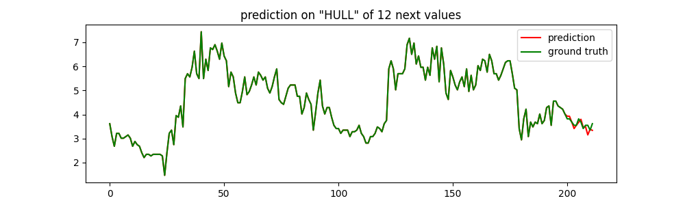
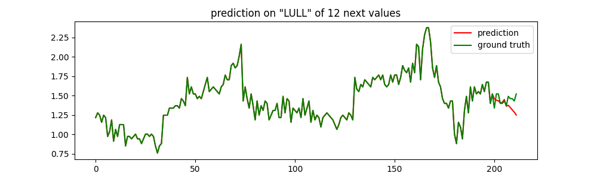

# iTransformer - Inverted Transformer
iTransformer is a Time Series Forcasting model. The model uses a different embedding method. It embeds each series independently to the variate token.
# About this project
- This is a personal project, for educational purposes only!
- This project is a small version converted to the Lightning model.
# Experiment
1. **Training**
    - Model size: ~6.4M params.
    - Dataset: [Electricity Transformer Dataset](datasets/ETDataset/ETT-small/ETTm1.csv).
    - Number of epochs: 10.
    - Platform: Google Colab free (with T4 GPU).
2. **Results**
    - The performance is acceptable when predicting the features: HUFL, HULL, LUFL, MUFL, MULL.
    - The performance is not good when predicting the features: LULL, OT.
     \
    
3. **Conclusions**

# How to use
1. Clone this repo, cd into iTransformer.
2. Install the requirements: pip install -q -r requirements.txt.
3. Modify the config file (./config.yaml), then run the below command:
    ```
    !python train.py \
      --max_epochs 3 \
      --ckpt_path 'path/to/checkpoint # add this line if resume the training from a checkpoint
    ```
# Based on
https://arxiv.org/abs/2310.06625 \
https://github.com/thuml/iTransformer \
https://github.com/lucidrains/iTransformer/tree/main


